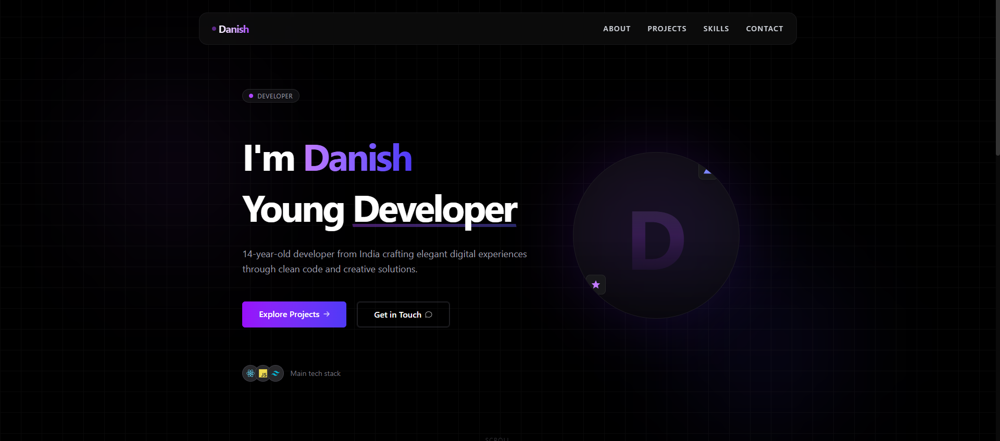
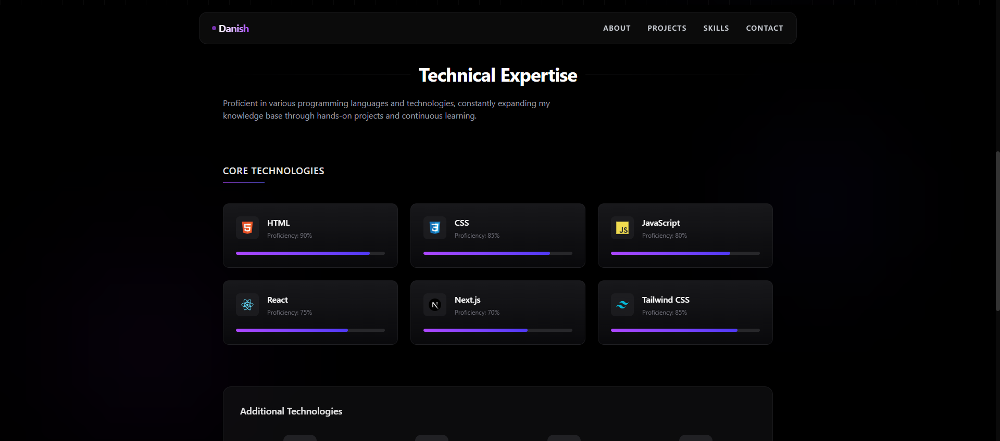
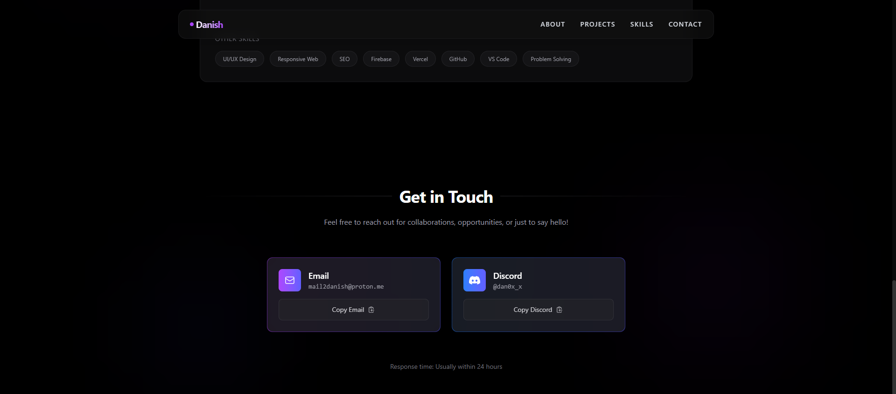

  # Danish's Portfolio
  
  

    A premium dark-themed portfolio showcasing my journey as a 14-year-old developer from India.
     
    <a href="https://danishzzx.vercel.app">View Demo</a>
    ·
    <a href="https://github.com/danishkhanx">Visit My GitHub</a>
  

## ✨ Features

- 🌙 Premium dark theme with glass-morphism effects
- 🎯 Smooth scrolling and section navigation
- 💫 Beautiful animations powered by Framer Motion
- 📱 Fully responsive design for all devices
- 🎨 Modern UI with gradient effects
- ⚡ Built with Next.js and Tailwind CSS

## 🖼️ Preview

### Hero Section

*A stunning hero section with animated elements and tech stack showcase*

### Skills Section

*Interactive skills display with animated progress bars*

### Contact Section

*Premium contact section with copy functionality*

## 🛠️ Built With

- [Next.js](https://nextjs.org/) - React Framework
- [Tailwind CSS](https://tailwindcss.com/) - Styling
- [Framer Motion](https://www.framer.com/motion/) - Animations
- [Geist Font](https://vercel.com/font) - Typography

## 🎨 Color Palette

- Primary Gradient: `from-purple-600 to-indigo-600`
- Background: `bg-black`
- Glass Effect: `bg-zinc-900/90 backdrop-blur-sm`
- Accent: `bg-purple-500`
- Text: `text-zinc-400`

## 🌟 Sections

- **Hero** - Engaging introduction with animated elements
- **Projects** - GitHub projects showcase with premium popup
- **Skills** - Interactive display of technical expertise
- **Contact** - Elegant contact section with social links

## 📫 Contact

- Email: mail2danish@proton.me
- Discord: @dan0x_x

## 🎉 Special Features

- Glass-morphism effects throughout the UI
- Smooth section transitions
- Interactive hover states
- Gradient borders and overlays
- Animated progress bars
- Copy functionality for contact information
- Responsive navbar with mobile menu
- Premium project showcase popup

---

  Made with ❤️ by Danish
   
   

 